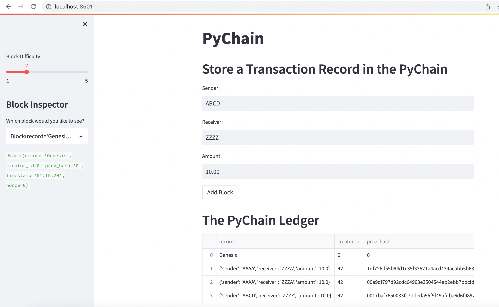
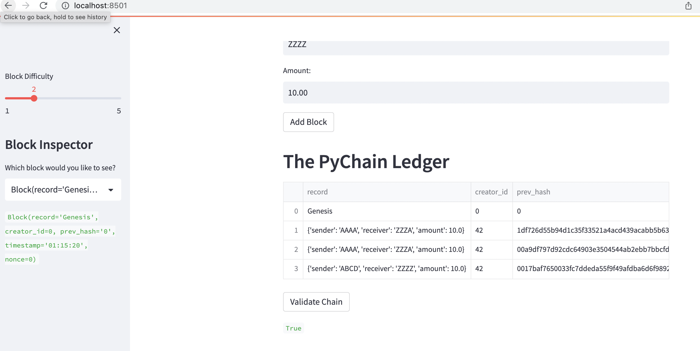

# pychain

The **pychain** is a blockchain-based ledger system, with a user-friendly web interface. This ledger allows partner banks to conduct financial transactions (that is, to transfer money between senders and receivers) and to verify the integrity of the data in the ledger.

---

## Technologies

This project leverages python 3.8.15 with the following packages:

* [Streamlit](https://streamlit.io/) - For web apps in minutes


---

## Installation Guide

Before running the application first install the following dependencies in conda dev environment.

```python

    conda create -n dev python=3.8 anaconda

    python -m ipykernel install --user --name dev

    conda activate dev

    pip install streamlit

    conda deactivate 
  
```

---


## Usage

To use the venture_funding_with_deep_learning  application simply clone the repository and run the **venture_funding_with_deep_learning.ipynb** with jupyter lab:

```python
    In the terminal, navigate to the project folder where the pychain.py

    In the terminal, run the Streamlit application by

    streamlit run pychain.py
```


pychain web app screen shots




---

## Contributors

Kausar Hina

---

## License

MIT


